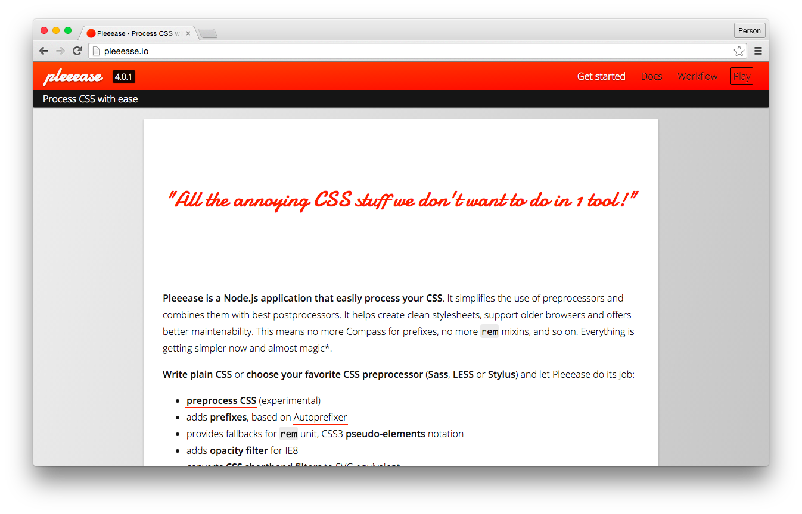

  We tend to solve a lot of front-end problems by delegating them to existing
  programs. We use libraries and tools which we don’t understand completely -
  and our code base grows and grows. But lately this trend seems to change and
  we slowly re-consider what we can do best: develop front-end code. What can we
  expect from this new trend and how can we use them in out daily business
  today?

<svg viewBox="0 0 24 24" xmlns="http://www.w3.org/2000/svg" class="icon icon--warning icon--left">
  <path d="M1 21h22L12 2 1 21zm12-3h-2v-2h2v2zm0-4h-2v-4h2v4z">
</svg> Disclaimer: This article was first published in
[Screen Guide Magazine](http://screengui.de/) in No. 26 in German as the
Working Draft Kolumne.

A few years ago designers developed a trend for more streamlined minimalisic
websites. WordPress templates were not polluted by bubblegum artworks but became
functional. Blogs began to focus on the content and not on design. “Do one
thing, do it right”.

Contrary to this developers used more and more tools to create websites,
complexity of front-end code grew and we expected developers to know about all
of it. Our work became more professional. We came as Webdesigners and are now
known as Front-end Engineers, developers with deep knowledge of programatic
paradigms and optimization which you need to generate modern, good performing
and minimalistic websites.

When I first used Sass a couple of years ago it was a blessing for me: Finally I
could use variables and nesting, no vendor prefixes anymore. My code became
easier to understand because I could use mixins and functions and redundency
could be avoided. I played around with other preprocessors like Stylus and LESS
to discover that Sass was the most easiest to understand for developers that now
CSS already.

The old Ant-based HTML5 Boilerplate builder was replaced by a modern Grunt
workflow which I finally understood and was able to fix by myself whenever I
needed to. Thousends of Grunt plugins are now available on npm and as a
developer I only need to understand the configuration and how the different
plugins work together. For example RequireJS with it’s builder r.js for
JavaScript modules and Jasmine utilized by Karma for unit testing. As it turns
out it is not that easy to implement all these tools to play nicely together.

## New Direction: Simplification

Within the last months the game seems to change. Developers want to leave behind
all the complexity that they have build up over time. For example in CSS
we disdain formerly loved functionality because of the experience we gathered.
Hugo Giraudel
[writes about the pitfalls of Sass’ `@extend](http://www.sitepoint.com/avoid-sass-extend/).
Twitter and other companies do not use preprocessors for CSS anymore and move
back to use Vanilla CSS to generate their web apps. This is because CSS can do
more than it used to and it will get more functionality in the near future. In
the end this is the success of developers and users of preprocessors which
engage in the discussion about the specification.

<figure class="image image--left" markdown="1">
  

<figcaption class="image__caption" markdown="1">
  [Pleeease](http://pleeease.io/) is a CSS post-processor
  Screenshot
</figcaption>
</figure>

But how we include these new features in today’s code? We add another tool to
our workflow to reduce complexity. For example [Pleeease](http://pleeease.io/)
already adds compatibility for CSS features which will be supported in browsers
in the future: variables (aka. Custom Properties), vendor specific prefixes via
Autoprefixer and the `color` function. In JavaScript we use ES6 transpilers like
Babel to add new language features like object orientation, block level
variables and modules. These tools transpile “new” code to code which can be
understood by today’s browsers.

What a contradiction. We trade a preprocessor for a postprocessor and thus
replace one tool by another. This doesn’t seem to be the way we want to go. BEM
becomes the defacto standard in CSS class naming but on the other hand most
developers don’t understand class names from a couple of years ago. JavaScript
libraries which provide helpers such as `map`, `forEach` or `reduce` get banned
from our code because browsers can do it on their own by now. But we include new
more complex libries to build stuff faster as before. Who really knows the
difference between React.js Components and Angular Directives on first sight?
Polyfills fill the gap which new technology bring to our browsers.

And then we can utilize front-end frameworks such as Bootstrap and Foundation
that provide a great starting point for certain projects. Finding an entrance to
those toolkits is made easy for most developers. If you try to understand what
is really going on these toolkits become complex monsters and hard to handle.

With Grunt and Gulp as build tools it’s the same: We only replace existing tools
like Ant and Make — same as we did with HTML5 Boilerplate’s build tool.

> I get the feeling we just transfer complexity somewhere else.

This is what my Working Draft co-host Stefan Baumgartner says to the new trend
to use npm as a build tool.

For me all of this is not a real problem. Why should we pass on a tool which
makes our lives easier? We use a dedicated editor and not Text Edit to write our
code even though Text Edit is easily accessible by Mac users and you can write
the same code on both editors.

From my perspective for example Pleeease is the right approach to bring
developers back to the basics of CSS development and to promote writing simple
and thus easy-to-understand code. Furthermore ES6-to-ES5 transpiler bring new
features which are direct improvements for us as developers. But still each case
asks for us to review the purpose of the technology we use.

In one of my projects we discussed how much time it was worth to ramp up a
developer who joins the team. If we differ from a cetain default it takes time
to build up knowledge and to share it – whether it’s in a one-on-one
conversation or in documentation which has to be written. But the problem is
that there is no such thing as a _default_ when it comes to tools and code
conventions. It all depends on people who work with the code and can be very
individual especially for long term projects.

To me it’s not about removing tools form your workflow. I believe it is
necessary to find the right tool for each individual case and with this keeping
complexity to a minimum. This reduction should be most important. For me
personally this means that I no longer use [INIT](http://use-init.com/) as a
starting point for each and every project even though the basic functionality
seems to be the same. Complexity should be as little as possible - this is most
important.

## Result

My decision to use Sass because it is easy to understand for someone who is used
to CSS was wrong. Nothing is easier to understand for someone that is used to
CSS than CSS itself. Lately in new projects I do not use Sass anymore.
Websites and apps we build become more complex year over year and we write code
for applications which should replace native software. And even here you can
find this anti trend of removing complex structure and tools in favor of doing
“just” our work. I mostly quit following each tool that pops up week after week
but from time to time I test new tools and how they can help me with my projects
- just so I don’t miss the trend. Especially if this trend is towards a more
simplistic environment.
