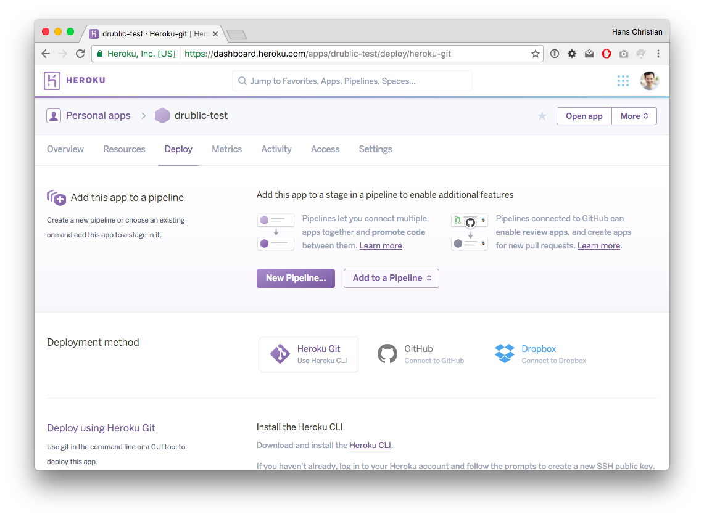

Lately I have been using [Heroku](https://heroku.com/) for all projects I needed to deploy.
I like Heroku for being easy to use and fast to set up.

Here are 5 steps how to quickly set up your application on Heroku.

## 1. Create a new Heroku Application

To start with a new application, let's register or log into Heroku.

After that you can easily create a new application from your Dashboard or visit [dashboard.heroku.com/new](https://dashboard.heroku.com/new).

<figure class="image image--block" markdown="1">
  
</figure>

Now let's add the name and region of the application that you want to publish. I will call my application `drublic-test`.

<figure class="image image--block" markdown="1">
  
</figure>

Apart from that we should create a `package.json` file within our application in order to identify as Node.js application.

## 2. Set up a Git Repository

After this we need to set up our application and a Git repository. The easiest way to deploy to Heroku is using GitHub: Each push can be automatically built and deployed. Continuous deployment for the win 🎉.

<figure class="image image--block" markdown="1">
  
</figure>

If you don’t want to use GitHub you can create a new remote repository and push to this repo to trigger a build and deployment.

You can add the repository via the [Heroku CLI](https://devcenter.heroku.com/articles/heroku-cli) like this, while `drublic-test` is the name of your application:

    heroku git:remote -a drublic-test

This is the same as running:

    git remote add heroku https://git.heroku.com/drublic-test.git

⚠️ &nbsp;Please login before running the command. You can do this by running:

    heroku login

Now the connection between your application and Heroku is set up.

## 3. Set up a Buildpack

Heroku uses so called Buildpacks to define the environment in which your application is published in. This needs to be set for each new application.

For a Node.js app you can do this by running:

    heroku buildpacks:set heroku/nodejs

More information about Buildpacks can be found [in the documentation](https://devcenter.heroku.com/articles/buildpacks).

⚠️ &nbsp;A Buildpack requires you to set up a `package.json` file in your repository to identify the application as a Node package.

## 4. Create a `Procfile`

The `Procfile` holds the configuration for your application to run.
For example if you want to run a Node.js application you can do as follows:

    web: node server.js

Or for an Apache Server serving your PHP app:

    web: vendor/bin/heroku-php-apache2 ./

Place the `Procfile` in your application’s root directory and add the according command.
You can [read more about the Procfile in the docs](https://devcenter.heroku.com/articles/procfile).

## 5. Push to Heroku

Now you can easily push to Heroku running the following command.

    git push heroku master

Just sit back and watch your application build on Heroku.

## Open your Application

You can now open your application at

    https://<application-name>.herokuapp.com/

With the test app from above we get [https://drublic-test.herokuapp.com/](https://drublic-test.herokuapp.com/). We expact an empty file here.

## Conclusion

That was easy, right? If you have any questions let me know [on Twitter](https://twitter.com/drublic).

⚠️ &nbsp;Disclaimer: This post is not sponsored by Heroku or anyone else.
